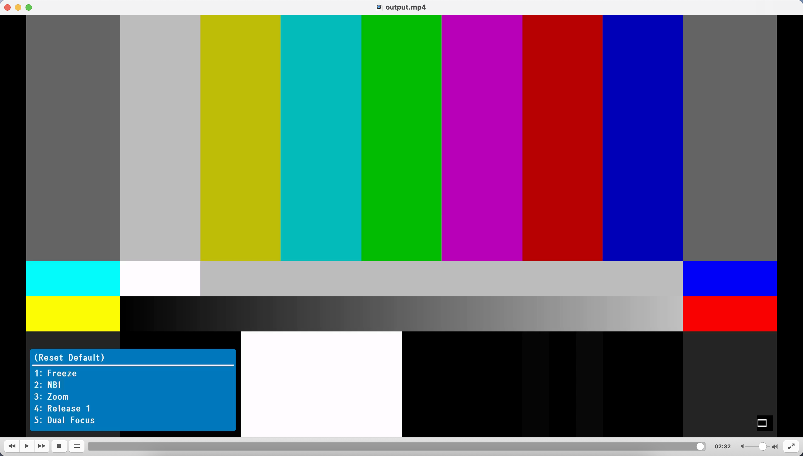

# APPS-200

# imginvid.py
Takes a clinical video as input. Looks for first frame which matches bars.png (a photo of color bars) and then trims the video to remove everything past the first instance of a matching frame. In other words, the script finds color bars in a video and removes them. 

# Findings
The script works as intended on 2022-02-1808-00-04_s_21_24638.2.mp4. Testing on 2022-05-2408-00-03_p_03.mp4 revealed that there are additional sets of colour bars 

